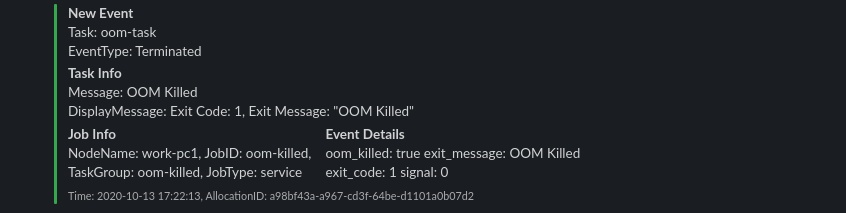

[](https://github.com/fivexl/nomad-events-to-slack/actions)

# Hashicorp Nomad events to Slack
Get nomad's allocations. Retrieve events from the tasks inside allocations. Post events to Slack channel as a Slack bot using incoming web hooks.  
It is possible to filter events by node name, jobid, event type and event message.


# App Configuration
Configuration is done via env variables

* `SLACK_WEB_HOOK_URL` - Slack web hook URL where to send events. Mandatory parameter.
* `NOMAD_EVENTS_TO_SLACK_DEBUG` -  Enable debug print outs to the log. `false` if not defined. Set to `true` to enable.
* `NODE_NAMES` - Filter nomad's event by node name. Able to use `${node.unique.name}` nomad's var. Many values separated by comma.
* `JOB_IDS` - Filter nomad's event by jobid (job name). Many values separated by comma.
* `EVENT_TYPES` - Filter nomad's event by event type. Many values separated by comma. Full list of events types: https://www.nomadproject.io/api-docs/allocations#events
* `EVENT_MESSAGE_FILTERS` - Filter nomad's event by event message. Many values separated by comma.
* `USE_CONSUL` - Use consul kv for save events that already sent to Slack. `false` if not defined. Set to `true` to enable.
* `CONSUL_KEY` - Set the consul kv key which used for save events. `nomad/nomad-events-to-slack` is default.

# Deployment
Application can be launched using docker  
For example inside a nomad. Don't forget to change Slack web hook url.
```hcl
job "events-to-slack" {
    datacenters = ["dc1"]
    type = "service"
    group "events-to-slack" {
        task "events-to-slack" {
            driver = "docker"
            env {
                SLACK_WEB_HOOK_URL="https://hooks.slack.com/services/XXXXX/XXXXX/xxxxxxxxxxxxxxxxxxxxx"
                NOMAD_EVENTS_TO_SLACK_DEBUG="false"
                NODE_NAMES="${node.unique.name},node2"
                JOB_IDS="oom-killed,job2"
                EVENT_TYPES="Terminated,Type2"
                EVENT_MESSAGE_FILTERS="OOM Killed,NotKilled"
                USE_CONSUL="true"
                CONSUL_KEY="nomad/nomad-events-to-slack"
            }
            config {
                image = "ghcr.io/fivexl/nomad-events-to-slack:latest"
            }
        }
    }
}
```

# Example message


# Nomad Configuration
This app supports Nomad environment variables: `NOMAD_ADDR`, `NOMAD_NAMESPACE`, `NOMAD_TOKEN`, `NOMAD_REGION`, `NOMAD_CLIENT_CERT` and `NOMAD_CLIENT_KEY`

```bash
NOMAD_ADDR=http://127.0.0.1:4646
NOMAD_NAMESPACE=default
NOMAD_TOKEN=xxxx-xxxx-xxxx-xxxx
NOMAD_REGION=global
NOMAD_CLIENT_CERT=/path/to/tls/client.crt
NOMAD_CLIENT_KEY=/path/to/tls/client.key
```


# Consul Configuration
This app supports Consul environment variables: `CONSUL_HTTP_ADDR`, `CONSUL_HTTP_TOKEN`, `CONSUL_HTTP_AUTH`, `CONSUL_HTTP_SSL`, `CONSUL_HTTP_SSL_VERIFY`, `CONSUL_CLIENT_CERT`, `CONSUL_CLIENT_KEY` and `CONSUL_NAMESPACE`
```bash
CONSUL_HTTP_ADDR=http://127.0.0.1:8500
CONSUL_HTTP_TOKEN=xxxx-xxxx-xxxx-xxxx
CONSUL_HTTP_AUTH=xxxxxxx
CONSUL_HTTP_SSL=false
CONSUL_HTTP_SSL_VERIFY=false
CONSUL_CLIENT_CERT=/path/to/tls/client.crt
CONSUL_CLIENT_KEY=/path/to/tls/client.key
CONSUL_NAMESPACE=default
```
 

## Example of Event to Send: 
```
{'AllocationID': '4f5c9fe9-7087-e213-6830-fc8e924db354', 'NodeName': 'node1', 'JobID': 'oom-killed', 'JobType': 'service',
 'TaskGroup': 'oom-killed', 'TaskName': 'oom-task', 'Time': '2020-10-12 15:10:02', 'EventType': 'Not Restarting', 'EventMessage': '', 
 'EventDisplayMessage': 'Exceeded allowed attempts 2 in interval 30m0s and mode is "fail"', 'EventDetails': 
 {'restart_reason': 'Exceeded allowed attempts 2 in interval 30m0s and mode is "fail"', 'fails_task': 'true'}}
```

## How to build and run local with docker
- `cp env.sample .env`
- `docker build -t nomad-events-to-slack:latest .`
- `docker run --net="host" --env-file .env nomad-events-to-slack:latest`

## Nomad Job for test notifications
```hcl
job "oom-killed" {
    datacenters = ["dc1"]
    type = "service"
    group "oom-killed" {
        task "oom-task" {
            driver = "docker"
            env {
                NODE_NAME="${node.unique.name}"
            }
            config {
                image = "zyfdedh/stress:latest"
                command = "sh"
                args = [ "-c", "sleep 10; stress --vm 1 --vm-bytes 50M" ]
            }
            resources {
                memory = 15 # MB
            }
        }
    }
}
```

### License and copyright notice
- https://github.com/jrxFive/python-nomad
- https://github.com/poppyred/python-consul2
